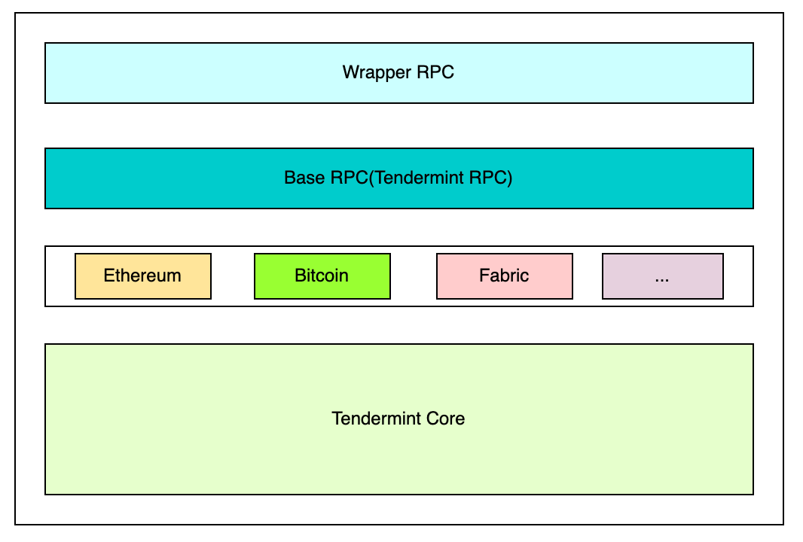

AGG Chain consists of the following parts:
- Tendermint Core: responsible for the blockchain storage layer, network layer and consensus layer
- L1 Chain Core: responsible for blockchain handling transaction and contract layer (optional)
- Base RPC: Tendermint RPC
- Wrapper RPC: responsible for providing RPC interface to the application layer that is compatible with existing products

