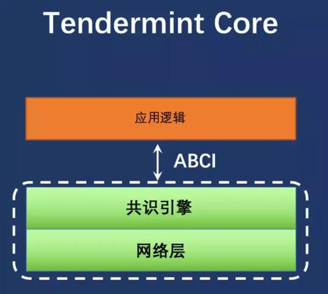

# 1. Tendermint是什么？

Tendermint是一种基于拜占庭容错(BFT)算法的共识引擎，用于构建可扩展的去中心化应用程序(DApps)和区块链平台。它是一个开源的项目，由Tendermint团队开发和维护。Tendermint的核心是一个BFT共识算法，它可以确保在分布式系统中达成一致的交易顺序。Tendermint的特点包括：

1. 高性能：Tendermint的共识算法可以在高负载下快速达成共识，每秒可处理数千个交易。

2. 安全性：Tendermint的BFT算法可以在最多1/3的节点崩溃或恶意行为的情况下，保证区块链系统的安全性。

3. 易于开发：Tendermint提供了一个简单易用的应用程序编程接口(API)，使得开发人员可以轻松地构建和部署去中心化应用程序(DApps)和区块链平台。

4. 可扩展性：Tendermint的共识算法可以水平扩展，支持多个区块链实例并行运行，从而提高了整个系统的可扩展性。

Tendermint已经被用于构建许多区块链平台和应用程序，例如 Cosmos。

# 2. Tendermint ABCI



一般在开始使用tendermint之前， 作为开发者应该最关心的就是abci接口了， 因为这个是和tendermint进行交互的关键。 个人觉得这个也是tendermint的优势之一。 有了这个接口定义才有了实现通用区块链平台的可能。

先从创建Node实例开始说， 在前面的文章中我们说到最开始创建abci客户端的地方就是在node启动中。在node/node.go

```go
// 这个函数是用于重放区块之前已经保存的区块
handshaker := cs.NewHandshaker(stateDB, state, blockStore, genDoc)

// 此处是创建abci客户端的关键 创建一个代理APP 然后管理
//多个模块的连接 (consensus, mempool, query)
// 也即是说我们今天分析的入口就是从这个函数开始
proxyApp := proxy.NewAppConns(clientCreator, handshaker)
if err := proxyApp.Start(); err != nil {
  return nil, fmt.Errorf("Error starting proxy app connections: %v", err)
}
```

`proxy.NewAppConns` 函数位于proxy/multi_app_con.go文件中。

我们先看一下proxyAPP的数据结构

```go
// multiAppConn implements AppConns.
//
// A multiAppConn is made of a few appConns and manages their underlying abci
// clients.
type multiAppConn struct {
  // 标准调用
	service.BaseService

  // 下面三个变量就是proxyapp用于管理的连接
  // 也就是说返回给内存池模块的客户端连接被封装在mempoolConn中
  // 返回给共识模块的客户端连接封装在了consensusConn
  // 返回给查询模块的连接封装在queryConn
  // 但是最终调用的地方还是abci.Client客户端的实现上。
	consensusConn AppConnConsensus
	mempoolConn   AppConnMempool
	queryConn     AppConnQuery
  
	snapshotConn  AppConnSnapshot

	consensusConnClient abcicli.Client
	mempoolConnClient   abcicli.Client
	queryConnClient     abcicli.Client
	snapshotConnClient  abcicli.Client

	clientCreator ClientCreator
}
```

```go
// NewAppConns calls NewMultiAppConn.
func NewAppConns(clientCreator ClientCreator) AppConns {
	return NewMultiAppConn(clientCreator)
}

// NewMultiAppConn makes all necessary abci connections to the application.
func NewMultiAppConn(clientCreator ClientCreator) AppConns {
	multiAppConn := &multiAppConn{
		clientCreator: clientCreator,
	}
	multiAppConn.BaseService = *service.NewBaseService(nil, "multiAppConn", multiAppConn)
	return multiAppConn
}
```

创建完ProxyAPP 下一步就是启动它看看启动流程。

```go
func (app *multiAppConn) OnStart() error {
  // 现在为了便于理解 我们就认为clientCreator是DefaultClientCreator这个函数 当调用clientCreator
  // 就是调用DefaultClientCreator函数 然后返回了abci接口的实例。

	// 可以明显的发现 tendermint为mempoolConn, consensusConn, queryConn均创建了abci接口的实例
	c, err := app.abciClientFor(connQuery)
	if err != nil {
		return err
	}
	app.queryConnClient = c
	app.queryConn = NewAppConnQuery(c)

	c, err = app.abciClientFor(connSnapshot)
	if err != nil {
		app.stopAllClients()
		return err
	}
	app.snapshotConnClient = c
	app.snapshotConn = NewAppConnSnapshot(c)

	c, err = app.abciClientFor(connMempool)
	if err != nil {
		app.stopAllClients()
		return err
	}
	app.mempoolConnClient = c
	app.mempoolConn = NewAppConnMempool(c)

	c, err = app.abciClientFor(connConsensus)
	if err != nil {
		app.stopAllClients()
		return err
	}
	app.consensusConnClient = c
	app.consensusConn = NewAppConnConsensus(c)

	// Kill Tendermint if the ABCI application crashes.
	go app.killTMOnClientError()

	return nil
}
```

所以分析完这个， 重心就被转移到abci的接口实例上面来了。 我们先看看abci.Client的接口都定义了哪些函数。

```go
// Client defines an interface for an ABCI client.
// All `Async` methods return a `ReqRes` object.
// All `Sync` methods return the appropriate protobuf ResponseXxx struct and an error.
// Note these are client errors, eg. ABCI socket connectivity issues.
// Application-related errors are reflected in response via ABCI error codes and logs.
type Client interface {
	service.Service

	SetResponseCallback(Callback)
	Error() error

	FlushAsync() *ReqRes
	EchoAsync(msg string) *ReqRes
	InfoAsync(types.RequestInfo) *ReqRes
	SetOptionAsync(types.RequestSetOption) *ReqRes
	DeliverTxAsync(types.RequestDeliverTx) *ReqRes
	CheckTxAsync(types.RequestCheckTx) *ReqRes
	QueryAsync(types.RequestQuery) *ReqRes
	CommitAsync() *ReqRes
	InitChainAsync(types.RequestInitChain) *ReqRes
	BeginBlockAsync(types.RequestBeginBlock) *ReqRes
	EndBlockAsync(types.RequestEndBlock) *ReqRes
	ListSnapshotsAsync(types.RequestListSnapshots) *ReqRes
	OfferSnapshotAsync(types.RequestOfferSnapshot) *ReqRes
	LoadSnapshotChunkAsync(types.RequestLoadSnapshotChunk) *ReqRes
	ApplySnapshotChunkAsync(types.RequestApplySnapshotChunk) *ReqRes

	FlushSync() error
	EchoSync(msg string) (*types.ResponseEcho, error)
	InfoSync(types.RequestInfo) (*types.ResponseInfo, error)
	SetOptionSync(types.RequestSetOption) (*types.ResponseSetOption, error)
	DeliverTxSync(types.RequestDeliverTx) (*types.ResponseDeliverTx, error)
	CheckTxSync(types.RequestCheckTx) (*types.ResponseCheckTx, error)
	QuerySync(types.RequestQuery) (*types.ResponseQuery, error)
	CommitSync() (*types.ResponseCommit, error)
	InitChainSync(types.RequestInitChain) (*types.ResponseInitChain, error)
	BeginBlockSync(types.RequestBeginBlock) (*types.ResponseBeginBlock, error)
	EndBlockSync(types.RequestEndBlock) (*types.ResponseEndBlock, error)
	ListSnapshotsSync(types.RequestListSnapshots) (*types.ResponseListSnapshots, error)
	OfferSnapshotSync(types.RequestOfferSnapshot) (*types.ResponseOfferSnapshot, error)
	LoadSnapshotChunkSync(types.RequestLoadSnapshotChunk) (*types.ResponseLoadSnapshotChunk, error)
	ApplySnapshotChunkSync(types.RequestApplySnapshotChunk) (*types.ResponseApplySnapshotChunk, error)
}
```

是不是觉得有些奇怪， 怎么定义的接口这么多， 但是需要我们实现的接口比这个要少一些呢。 主要是tendermint对abci.Client又进行了一次封装， 上面这些接口供给 mempoolConn consensusConn queryConn 使用的， 然后具体的调用再由abci.Client的实例调用我们实现的必不可少的那几个接口。 所以我们最后要最终到`DefaultClientCreator`看一看实现的abci实例对象。

```go
// DefaultClientCreator returns a default ClientCreator, which will create a
// local client if addr is one of: 'counter', 'counter_serial', 'kvstore',
// 'persistent_kvstore' or 'noop', otherwise - a remote client.
func DefaultClientCreator(addr, transport, dbDir string) ClientCreator {
	switch addr {
	case "counter":
		return NewLocalClientCreator(counter.NewApplication(false))
	case "counter_serial":
		return NewLocalClientCreator(counter.NewApplication(true))
	case "kvstore":
    // 这个abci的实例 就是tendermint在文档中提到的创建的KV数据的实例客户端 
	  // 我们在tendermint的文档上是可以看到tendermint为了支持其他语言 所有可以使用非go的版本 其实非go的版本就是
	  // 通过socket或者grpc进行通信。 
	  // 也就是最后的默认分支创建的abci实例
	  // 但是作为一个gopher当然是选择直接集成的tendermint中了。 所以我们一会主要分析NewLocalClientCreator函数
	  // 其实其他语言的扩展是类似。分析完NewLocalClientCreator函数 就明白了。
		return NewLocalClientCreator(kvstore.NewApplication())
	case "persistent_kvstore":
		return NewLocalClientCreator(kvstore.NewPersistentKVStoreApplication(dbDir))
	case "e2e":
		app, err := e2e.NewApplication(e2e.DefaultConfig(dbDir))
		if err != nil {
			panic(err)
		}
		return NewLocalClientCreator(app)
	case "noop":
		return NewLocalClientCreator(types.NewBaseApplication())
	default:
		mustConnect := false // loop retrying
		return NewRemoteClientCreator(addr, transport, mustConnect)
	}
}
```

我们注意一下NewLocalClientCreator需要传递的参数types.Application 是的， 你没看错， 就是这个接口， 这个接口才是开发者最终要实现的接口。 我们列一下这个接口。

```go
// Application is an interface that enables any finite, deterministic state machine
// to be driven by a blockchain-based replication engine via the ABCI.
// All methods take a RequestXxx argument and return a ResponseXxx argument,
// except CheckTx/DeliverTx, which take `tx []byte`, and `Commit`, which takes nothing.
type Application interface {
	// Info/Query Connection
	Info(RequestInfo) ResponseInfo                // Return application info
	SetOption(RequestSetOption) ResponseSetOption // Set application option
	Query(RequestQuery) ResponseQuery             // Query for state

	// Mempool Connection
	CheckTx(RequestCheckTx) ResponseCheckTx // Validate a tx for the mempool

	// Consensus Connection
	InitChain(RequestInitChain) ResponseInitChain    // Initialize blockchain w validators/other info from TendermintCore
	BeginBlock(RequestBeginBlock) ResponseBeginBlock // Signals the beginning of a block
	DeliverTx(RequestDeliverTx) ResponseDeliverTx    // Deliver a tx for full processing
	EndBlock(RequestEndBlock) ResponseEndBlock       // Signals the end of a block, returns changes to the validator set
	Commit() ResponseCommit                          // Commit the state and return the application Merkle root hash

	// State Sync Connection
	ListSnapshots(RequestListSnapshots) ResponseListSnapshots                // List available snapshots
	OfferSnapshot(RequestOfferSnapshot) ResponseOfferSnapshot                // Offer a snapshot to the application
	LoadSnapshotChunk(RequestLoadSnapshotChunk) ResponseLoadSnapshotChunk    // Load a snapshot chunk
	ApplySnapshotChunk(RequestApplySnapshotChunk) ResponseApplySnapshotChunk // Apply a shapshot chunk
}
```

我们来具体看看NewLocalClientCreator返回的localClient这个对象。由于篇幅问题我只列出localClient实现的abci.Client部分函数。

```go
func (app *localClient) InfoAsync(req types.RequestInfo) *ReqRes {
	app.mtx.Lock()
	defer app.mtx.Unlock()

  // 此处最终调用了开发者要实现的Info函数
	res := app.Application.Info(req)
	return app.callback(
		types.ToRequestInfo(req),
		types.ToResponseInfo(res),
	)
}

func (app *localClient) DeliverTxAsync(params types.RequestDeliverTx) *ReqRes {
	app.mtx.Lock()
	defer app.mtx.Unlock()

  // 此处调用了开发者要实现的DeliverTx函数
	res := app.Application.DeliverTx(params)
	return app.callback(
		types.ToRequestDeliverTx(params),
		types.ToResponseDeliverTx(res),
	)
}
```

在`ApplyBlock`函数，从`proxyApp`中得到`consensusConn`然后调用了`BeginBlockSync()`、 `CheckTxSync()`、 `EndBlockSync()`， `CommitSync()`其实质就是调用了 `localClient` 的 `BeginBlockSync()`、 `CheckTxSync()`、 `EndBlockSync()`、 `CommitSync()`。 最终又调用开发者实现的`BeginBlock`、`DeliverTx`、 `EndBlock`、 `Commit`。

# 3. 创建一个应用

我们接下来具体分析需要实现的每一个函数

```go
Info(RequestInfo) ResponseInfo                // Return application info
SetOption(RequestSetOption) ResponseSetOption // Set application option
Query(RequestQuery) ResponseQuery             // Query for state
```

这三个函数主要用在查询上。 Info主要是返回APP的信息。 我以之前写的demo来举例。

```go
// 注意 如果你实现的区块链应用中有APPHASH 一定要保存 它们非常关键 否则
// 下次再启动的时候 重放之前的区块会出现异常的。
func (app *ConchApplication) Info(req types.RequestInfo) types.ResponseInfo {
	// load state from
	err := app.state.HeadSt.LoadHeaderState()
	if err != nil {
		app.logger.Error("load state from db failed", "err", err.Error())
		panic(err)
	}

	var res types.ResponseInfo
	res.LastBlockAppHash, _ = hex.DecodeString(app.state.HeadSt.CurAPPHash)
	res.LastBlockHeight = app.state.HeadSt.CurBlockNum
	res.Version = "v0.01"
	res.Data = "conch is an virtual currency"
	return res
}
```

`SetOption` 函数 可以直接返回空 一般情况可以不用设置。 `Query` 函数是当我们使用tendermint的查询接口时， 最终会调用到我们实现的这个函数。当我们进行类似下面的Get请求。

```bash
curl localhost:26657/abci_query?path=""&data="abcd"&trusted=false
```

最终就会调用到我们的Query函数。 该函数会收到的参数有path和data 然后根据这两个参数进行特别的处理。tendermin已经进行了一些接口的路由实现。 具体的rpc请求流程在rpc包中。 这里我们不具体分析。 如果你想扩展rpc函数， 只需在rpc/core/route.go中注册自己的函数就可以了。

`CheckTx`函数的作用是来决定是否将受到的交易放到交易池中。 之前我们在内存池模块分析的时候说到， tendermint最初是将受到的交易先放到缓存区中的， 最终调用开发者实现的CheckTx函数来决定是否把在缓存区中的交易放到内存池中。 因为只有在内存池中的交易才会打包入区块。 这样做目的很明确，可以让应用层来决定此交易是否是合法的。

`InitChain`这个函数只在tendermint第一次初始化时才调用的， 主要功能就是给应用层提交了初始的区块验证者和链ID。 这样你可以在应用层初始化时增加新的验证者， 修改共识参数。 此函数只有在tendermint第一次启动时才会调用。 默认情况下， 也可以直接返回空， 直接在配置文件中增加共识参数和验证者即可。

```go
BeginBlock(RequestBeginBlock) ResponseBeginBlock // Signals the beginning of a block
DeliverTx(tx []byte) ResponseDeliverTx           // Deliver a tx for full processing
EndBlock(RequestEndBlock) ResponseEndBlock       // Signals the end of a block, returns changes to the validator set
Commit() ResponseCommit     
```

上面这个函数其实是关键。 BeginBlock表示tendermint告诉应用层准备ApplyBlock了， DeliverTx函数会被循环调用， 将打包的区块中的交易循环提交给了应用层， 也就是说应用层的主要状态流程其实是从此次开始的， 比如说进行账户金额变动， 执行虚拟机等。 大部分业务扩展都在于此。 EndBlock表示tendermint一个区块的数据已经提交完成了。Commit是告诉应用层做一次整个区块的提交。 比如应用层进行数据状态确认， 生成merkelhash等等返回最终的APPHASH。

所以分析到这里的第一个注意点就是， 一个区块的BeginBlock->DeliverTx->EndBlock->Commit是有序和单线的。 大可放心不会有并发问题，整个应用层状态的更新不会出现并发导致的任何异常情况。 需要注意的另一个点就是 我们之前看到tendermint是创建多个客户端实例进行调用的。 所以在编写接口时一定不要在实现客户端实例中涉及到全局信息。 比如区块高度， 账户信息等。 这些应该放到一个全局状态对象中处理。 大可放心， 不会有竞争问题。

到这里， 整个tendermint的abci流程就分析差不多了。参考一下tendermint的创建的KV示例。

# 4. 文档

- Tendermint version: [v0.34.24](https://github.com/tendermint/tendermint/tree/v0.34.24)